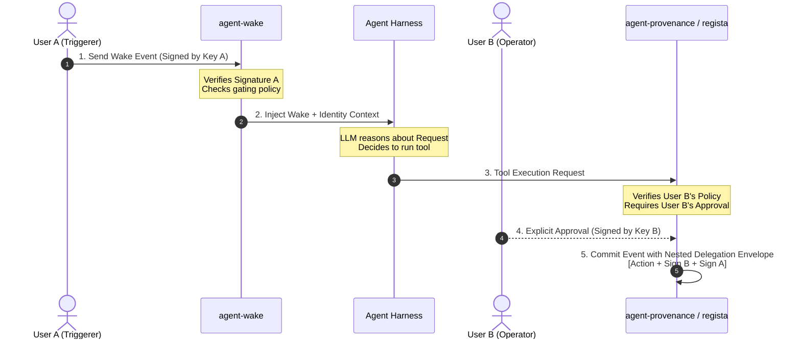

# Positions on Identity and Multi-User Design

**Status:** Proposed positions / responses to design questions  
**Author:** Antigravity (AI Coding Assistant)  
**Date:** 2026-05-23

This document outlines structural and cryptographic recommendations for introducing multi-user support to **agent-wake**, **agent-provenance**, and **regista**. It answers the key design questions proposed in [identity-and-multi-user.md](file:///projects/agent-wake/design/identity-and-multi-user.md).

---

## Architectural Principles

Before answering the individual questions, we propose three core guiding principles to keep the design lean, robust, and aligned with the single-person OSS posture:

1. **Cryptographic Decentralization**: Avoid centralized auth databases or mandatory cloud SaaS. Treat identity as a local, peer-to-peer cryptographic assertion.
2. **Invisible Complexity**: The developer or solo operator should see *zero* overhead. Single-user dogfooding must remain simple; multi-user structures should run invisibly under the hood as a "degenerate case" of a single actor.
3. **Audit Immutability**: LLMs operate in untrusted zones. Identity verification, policy enforcement, and provenance recording must happen *outside* the agent's context window to prevent spoofing or injection-based tampering.

---

## Positions on the Key Questions



### 1. Where does the user-identity primitive live?

> [!NOTE]
> **Position:** Identity belongs in **regista**.

* **Why:** Regista is the durable event store and coordination engine. A cryptographic signature is meaningless without an assertion of *who* owns the signing key. Because regista already provides event-signing primitives and Postgres-backed durable state, it is the natural place to manage the mapping of public keys to identity metadata.
* **Impact:** Downstream projects (`agent-wake` and `agent-provenance`) import and consume regista's identity models, treating regista as the cryptographic source of truth. This prevents downstream mapping synchronization errors.

---

### 2. What is the identity primitive?

> [!TIP]
> **Position:** An **opaque, URI-based identity schema** (e.g., `did:key:...` or `did:oidc:...`) paired with an exchangeable **Identity Profile Document**.

* **The Schema:** Use a uniform identifier syntax on-the-wire, allowing different deployments to choose their trust models:
  * **P2P / Self-Sovereign Mode:** Use `did:key:z6Mku...` (public key fingerprint).
  * **Enterprise / SSO Mode:** Use `did:oidc:google:12345` or `did:oidc:okta:corp-sub`.
* **The Profile Document:** A simple, signed JSON document containing:
  ```json
  {
    "id": "did:key:z6Mku...",
    "name": "Alice Developer",
    "email": "alice@company.com",
    "public_keys": [
      { "id": "key-1", "type": "Ed25519VerificationKey2020", "publicKeyMultibase": "z6Mku..." }
    ],
    "rotation_history": []
  }
  ```
* **Why this works:** It decouples protocol logic from deployment details. The core engine treats IDs as opaque strings. Verification steps resolve these strings against local directories or verification keys, accommodating both solo and corporate compliance without doubling the code footprint.

---

### 3. What's the deployment model for multi-user?

> [!IMPORTANT]
> **Position:** **Collaborative Peer Model first**, with an optional **Stateless Relay** for cross-network coordination.

* **Solo + Auditors:** Zero infrastructure changes. The auditor is just another public key registered on the operator's local machine. The operator shares their signed database logs (or hash chains) with the auditor offline or via read-only file exports.
* **Small Team:** Team members can share a central Postgres instance (leveraging regista's schema-per-project isolation) or exchange keys via a git repository (`.agent-keys/` directory in the project repository).
* **Cross-Org (Scenario 3):** To bridge firewalls without a hosted SaaS, introduce a **stateless, zero-knowledge HTTP relay**. The relay simply forwards signed JSON payloads between `agent-wake` instances. Since all payloads are cryptographically signed and encrypted by the peers, the relay does not need authentication, database storage, or multi-tenant user management, making it trivial to self-host.

---

### 4. How does identity propagate across the three projects?

#### Trigger vs. Actor Identity (The Nested Signature Envelope)
When User A wakes User B's agent, the provenance trail must reflect both. We propose a **nested cryptographic envelope**:
$$\text{EventSignature}_{\text{Operator}} \left( \text{ToolAction} + \text{TriggerSignature}_{\text{Sender}}(\text{WakePayload}) \right)$$
This permanently binds the operator's execution to the explicit trigger event that caused it, preserving the chain of causality in the audit trail.

#### Implicit vs. Explicit Propagation
* **Explicit Context Injection:** The agent harness must inject readable text into the LLM context: `<sender identity="Alice">Hello agent...</sender>`. This allows the agent to reason about permissions and structure its responses appropriately.
* **Out-of-Band System Stamps:** The agent cannot be trusted to self-report who it is acting for. Therefore, `agent-provenance` and `regista` must stamp and sign the provenance trail at the *system boundary level* (inside the harness execution environment), completely isolated from the LLM's text output. If the LLM is compromised via prompt injection, the signed audit trail still accurately reflects the physical channels and identities involved.

---

### 5. What does delegation actually mean?

> [!NOTE]
> **Position:** **Policy-Gated Delegation with Per-Action Consent Gaps.**

To balance autonomous execution with compliance, we propose three tiers of authorization:

| Tier | Name | Behavior | Target Scenario |
| :--- | :--- | :--- | :--- |
| **Tier 1** | **Strict (Manual)** | The harness blocks every tool call and prompts the active operator for signed manual approval. | High-risk environments (financial, production deployments). |
| **Tier 2** | **Policy-Gated** | The operator pre-authorizes specific actions (e.g., `git read`, `npm test`) for a given trigger sender using a local, signed policy file. | Standard team pipelines and recurring tasks. |
| **Tier 3** | **Explicit Request-for-Consent** | The agent pauses, sends a secure out-of-band message to the triggering user requesting a signature, and resumes once the signature is returned. | Interactive tasks requiring external authorization. |

This ensures that "acting under delegation" is always backed by a signed, machine-readable policy block or an explicit signature chain in regista.

---

### 6. Auditors as a first-class role

* **Auditing is Verification, not Access:** Auditors do not need real-time read access to running databases. Instead, they ingest **durable audit bundles** (standardized JSON exports of regista event chains).
* **Cryptographic Attestations:** When an auditor completes a review, they should generate an `AuditAttestation` object containing:
  1. The hash of the latest verified log entry.
  2. The compliance status (e.g., `APPROVED`, `FLAGGED`).
  3. A cryptographic signature using the auditor's key.
* This attestation is appended to the regista log, making the audit process itself verifiable and immortalized in the event stream.

---

### 7. Key management

To avoid writing complex key-management infrastructure, we should delegate to existing developer tools:

* **Generation / Storage:** Standard SSH keys (`~/.ssh/id_ed25519`) or Git signing keys. Developers already understand how to manage and protect these keys.
* **Rotation:** A first-class `KeyRotationEvent` signed by both the old key and the new key is committed to the event log. Verifiers walk the log, updating their active key database as they encounter signed rotations.
* **Revocation:** In a peer model, a list of revoked keys is maintained in a local blocklist configuration (e.g., `.agent-revocations` in the project repo) or broadcasted via signed revocation certificates.

---

### 8. Sender gating in a multi-user world

* **Policy Allowlist:** The global allowlist should be replaced with a structured peer gating file (e.g., `wake-gate.json`), mapping incoming webhook signatures to specific user IDs and permissible actions.
* **Gating Execution Flow:**
  ```
  Incoming Webhook ──> [Signature Verification] ──> [Match against wake-gate.json]
                                                                │
                                                  ┌─────────────┴─────────────┐
                                                  ▼                           ▼
                                              [Allowed]                   [Rejected]
                                                  │                           │
                                         Inject into Harness            Ignore / Alarm
  ```

---

### 9. Backwards compatibility with single-user dogfood

> [!IMPORTANT]
> **Position:** **Single-user is the degenerate case of multi-user.**

* **No Separate Code Paths:** There should only be one codebase. 
* **The "Implicit Self" Pattern:** On first boot, if no identities are configured, the system automatically generates a local `default-actor` keypair and registers it in the local workspace. All downstream events are signed and formatted under the exact same schemas used in team environments.
* **Zero Friction:** The developer never sees a public key or configures a policy. When they eventually want to onboard an auditor, the system simply exports their existing local public key—which has been building cryptographically valid logs from day one.
